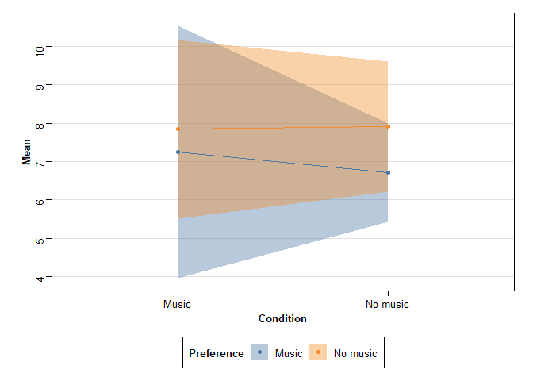

Background Music, Music Preference, and Word Recall Analysis
================
Caiden Nimchuk
2024-11-01

``` r
library(ggthemes)
library(knitr)
library(pander)
library(rstatix)
library(tidyverse)

panderOptions('table.style', 'rmarkdown')
options(dplyr.summarise.inform = FALSE)
options(digits = 3)

theme_set(theme_stata(scheme = 's2mono'))
theme_update(legend.position = 'none')
theme_update(axis.title = element_text(face = "bold"))

scale_colour_discrete <- function() {
  scale_color_tableau()
}

scale_fill_discrete <- function() {
  scale_fill_tableau()
}

scale_x_int <- function(n) {
  scale_x_continuous(breaks = function(limits) {
    seq(from = 0, to = ceiling(limits[2]), by = n)
  })
}

scale_y_int <- function(n) {
  scale_y_continuous(breaks = function(limits) {
    seq(from = 0, to = ceiling(limits[2]), by = n)
  })
}


bmmpwr_data <- read_csv('BMMPWR-Clean-Data.csv', show_col_types = FALSE)
```

# Demographic information

## Gender

``` r
gender_freq <-
  bmmpwr_data %>%
  count(Gender)

pander(gender_freq)
```

| Gender |  n  |
|:------:|:---:|
| Female | 26  |
|  Male  |  8  |
| Other  |  1  |

``` r
gender_freq_plot <-
  bmmpwr_data %>%
    ggplot(aes(x = Gender, fill = TRUE)) +
    geom_bar() +
    scale_y_int(4) +
    ylab('Count')

gender_freq_plot
```

<!-- -->

## Race or ethnicity

``` r
race_freq <-
  bmmpwr_data %>%
  count(`Race or ethnicity`) %>%
  slice(1:4, 6, 5)

pander(race_freq)
```

|        Race or ethnicity        |  n  |
|:-------------------------------:|:---:|
|              Asian              |  6  |
|    Black or African American    |  4  |
| Middle Eastern or North African |  2  |
|   Multiracial or multiethnic    |  3  |
|              White              | 19  |
|        Prefer not to say        |  1  |

``` r
race_freq_plot <-
  race_freq %>%
    mutate(`Race or ethnicity` = recode(`Race or ethnicity`, 
                                        `Black or African American` = 'Black', 
                                        `Middle Eastern or North African` = 'MENA descent',
                                        `Multiracial or multiethnic` = 'Multiple')) %>%
    ggplot(aes(x = reorder(`Race or ethnicity`, -n), y = n, fill = TRUE)) +
    geom_bar(stat = 'identity') +
    scale_y_int(4) +
    xlab('Race or ethnicity') +
    ylab('Count')

race_freq_plot
```

<!-- -->

## Age

``` r
age_summ <-
  bmmpwr_data %>%
  summarize(Median = median(Age),
            Mean = mean(Age),
            SD = sd(Age),
            Min = min(Age),
            Max = max(Age))

pander(age_summ)
```

| Median | Mean  |  SD   | Min | Max |
|:------:|:-----:|:-----:|:---:|:---:|
|   19   | 19.29 | 1.792 | 16  | 25  |

``` r
age_plot <-
  bmmpwr_data %>%
    ggplot(aes(x = Age, fill = TRUE)) +
    geom_histogram(binwidth = 1) +
    scale_x_int(1) +
    scale_y_int(2) +
    ylab('Count')

age_plot
```

<!-- -->

# Score distributions

## Score distributions by gender

``` r
gender_dist <-
  bmmpwr_data %>%
  group_by(Gender) %>%
  summarize(Count = n(),
            Median = median(Score),
            Mean = mean(Score),
            SD = sd(Score))

pander(gender_dist)
```

| Gender | Count | Median | Mean  |  SD   |
|:------:|:-----:|:------:|:-----:|:-----:|
| Female |  26   |   7    | 7.692 | 2.811 |
|  Male  |   8   |   7    | 7.125 | 3.227 |
| Other  |   1   |   8    |   8   |  NA   |

``` r
gender_dist_plot <-
  gender_dist %>%
    mutate(replace_na(0)) %>%
    mutate(ci = suppressWarnings(qt(p = 0.025, df = Count-1)) * (SD / sqrt(Count))) %>%
    ggplot(aes(x = Gender, y = Mean, fill = TRUE)) +
    geom_bar(stat = 'identity') +
    geom_errorbar(aes(ymin = Mean - ci, ymax = Mean + ci)) +
    scale_y_int(2) +
    ylab('Mean Score')

gender_dist_plot
```

<!-- -->

## Score distributions between groups

``` r
cond_dist <-
  bmmpwr_data %>%
  group_by(Condition) %>%
  summarize(Count = n(),
            Median = median(Score),
            Mean = mean(Score),
            SD = sd(Score))

pander(cond_dist)
```

| Condition | Count | Median | Mean  |  SD   |
|:---------:|:-----:|:------:|:-----:|:-----:|
|   Music   |  17   |   7    | 7.706 | 3.46  |
| No music  |  18   |  7.5   | 7.444 | 2.175 |

``` r
cond_dist_plot <-
  cond_dist %>%
    mutate(ci = qt(p = 0.025, df = Count-1) * (SD / sqrt(Count))) %>%
    ggplot(aes(x = Condition, y = Mean, fill = TRUE)) +
    geom_bar(stat = 'identity') +
    geom_errorbar(aes(ymin = Mean - ci, ymax = Mean + ci)) +
    scale_y_int(2) +
    ylab('Mean Score')

cond_dist_plot
```

<!-- -->

``` r
pref_dist <-
  bmmpwr_data %>%
  group_by(Preference) %>%
  summarize(Count = n(),
            Median = median(Score),
            Mean = mean(Score),
            SD = sd(Score))

pander(pref_dist)
```

| Preference | Count | Median | Mean  |  SD   |
|:----------:|:-----:|:------:|:-----:|:-----:|
|   Music    |  11   |   7    | 6.909 | 1.578 |
|  No music  |  24   |   8    | 7.875 | 3.234 |

``` r
pref_dist_plot <-
  pref_dist %>%
    mutate(ci = qt(p = 0.025, df = Count-1) * (SD / sqrt(Count))) %>%
    ggplot(aes(x = Preference, y = Mean, fill = TRUE)) +
    geom_bar(stat = 'identity') +
    geom_errorbar(aes(ymin = Mean - ci, ymax = Mean + ci)) +
    scale_y_int(2) +
    ylab('Mean Score')

pref_dist_plot
```

<!-- -->

## Score distributions within groups

``` r
within_dists <-
  bmmpwr_data %>%
  group_by(Condition, Preference) %>%
  summarize(Count = n(),
            Median = median(Score),
            Mean = mean(Score),
            SD = sd(Score))

pander(within_dists)
```

| Condition | Preference | Count | Median | Mean  |  SD   |
|:---------:|:----------:|:-----:|:------:|:-----:|:-----:|
|   Music   |   Music    |   4   |  7.5   | 7.25  | 2.062 |
|   Music   |  No music  |  13   |   7    | 7.846 | 3.848 |
| No music  |   Music    |   7   |   7    | 6.714 | 1.38  |
| No music  |  No music  |  11   |   8    | 7.909 | 2.508 |

``` r
within_dists_plot <-
  within_dists %>%
    mutate(ci = qt(p = 0.025, df = Count-1) * (SD / sqrt(Count))) %>%
    ggplot(aes(x = Condition, y = Mean, group = Preference, fill = Preference)) +
    geom_bar(position = "dodge", stat = "identity") +
    geom_errorbar(position = "dodge", aes(ymin = Mean - ci, ymax = Mean + ci)) +
    scale_y_int(2) +
    ylab('Mean Score')

within_dists_plot
```

<!-- -->

# Tests

## Gender effect t-test

``` r
gender_t <-
  bmmpwr_data %>%
  filter(Gender != 'Other') %>%
  t_test(Score ~ Gender,
         alternative = 'greater') %>%
  rename('Group 1' = group1,
         'Group 2' = group2,
         'Variable' = .y.,
         'Statistic' = statistic)

pander(gender_t)
```

| Variable | Group 1 | Group 2 | n1  | n2  | Statistic |  df   |   p   |
|:--------:|:-------:|:-------:|:---:|:---:|:---------:|:-----:|:-----:|
|  Score   | Female  |  Male   | 26  |  8  |  0.4478   | 10.49 | 0.332 |

## Condition effect t-test

``` r
cond_t <-
  bmmpwr_data %>%
  t_test(Score ~ Condition,
         alternative = 'less') %>%
  rename('Condition 1' = group1,
         'Condition 2' = group2,
         'Variable' = .y.,
         'Statistic' = statistic)

pander(cond_t)
```

| Variable | Condition 1 | Condition 2 | n1  | n2  | Statistic |  df   |   p   |
|:--------:|:-----------:|:-----------:|:---:|:---:|:---------:|:-----:|:-----:|
|  Score   |    Music    |  No music   | 17  | 18  |  0.2659   | 26.68 | 0.604 |

## ANOVA test

``` r
cond_pref_anova <-
  bmmpwr_data %>%
  anova_test(Score ~ Condition * Preference, type = 3, detailed = TRUE) %>%
  as_tibble() %>%
  select(-`p<.05`, -ges) %>%
  filter(Effect != "(Intercept)")

pander(cond_pref_anova)
```

|        Effect        |  SSn  |  SSd  | DFn | DFd |   F   |   p   |
|:--------------------:|:-----:|:-----:|:---:|:---:|:-----:|:-----:|
|      Condition       | 0.399 | 264.8 |  1  | 31  | 0.047 | 0.83  |
|      Preference      | 5.721 | 264.8 |  1  | 31  | 0.67  | 0.419 |
| Condition:Preference | 0.639 | 264.8 |  1  | 31  | 0.075 | 0.786 |

``` r
cond_pref_anova_plot <-

within_dists %>%
  mutate(ci = qt(p = 0.025, df = Count-1) * (SD / sqrt(Count))) %>%
  ggplot(aes(x = Condition, y = Mean, group = Preference, color = Preference, fill = Preference)) +
  geom_ribbon(aes(ymin = Mean - ci, ymax = Mean + ci), alpha = 0.4, color = NA) +
  geom_line() + 
  geom_point() +
  scale_y_int(1)

cond_pref_anova_plot
```

<!-- -->
